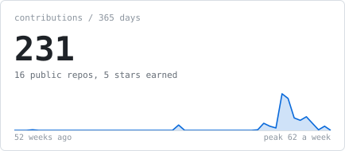
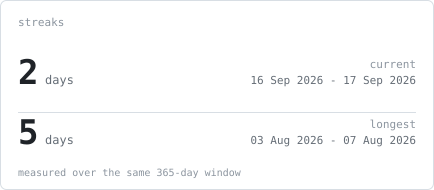
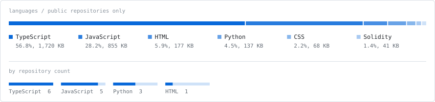
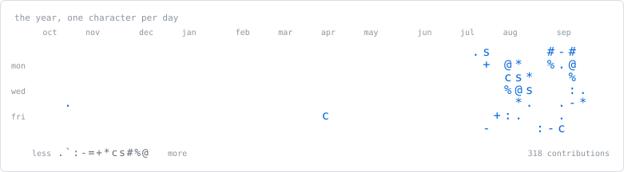

### Kalairaajan Thiagarajan

<samp>applied computing (fintech) · singapore institute of technology · singapore</samp>

<a href="https://linkedin.com/in/kalairaajan">linkedin</a> ·
<a href="mailto:kalairaajan@gmail.com">email</a> ·
<a href="https://github.com/likalight?tab=repositories">repositories</a>

 

> I work on the operations side of software — incident automation, retrieval
> systems, and the evaluation harnesses that decide whether either of them is
> actually working.

 

Third year of a BSc (Honours) in Applied Computing (FinTech) at the Singapore 
Institute of Technology, graduating August 2027. Before that, two years as an 
intelligence analyst, which is where the habit of trusting measurement over 
intuition comes from.

Most of what I build is unglamorous by design: a runbook that fires before the 
on-call engineer wakes up, an ETL job that turns ten gigabytes of chat logs into 
twelve categories worth acting on, an eval harness that blocks a release. The 
interesting part is never the model. It is what happens when the model is wrong.

 

<samp>&nbsp;→&nbsp;</samp> Finishing my degree at SIT, and building in the open 
<samp>&nbsp;→&nbsp;</samp> Available for a full-time internship, January to August 2027 
<samp>&nbsp;→&nbsp;</samp> Currently reading about agent evaluation and failure taxonomies

 

**Systems Engineer Intern** — Visa, Operations & Infrastructure (Containers) 
<samp>may 2026 – jul 2026 · kubernetes, bash, linux, python, mcp, rag</samp>

Analysed 3,500 historical Kubernetes incidents, found that 18% were recurring 
failures, and wrote the Bash remediation workflows for them. Built an AI triage 
agent that diagnoses each incoming incident and hands the on-call engineer a 
remediation plan before they engage — 40% off time-to-resolution. Shipped 
read-only `kubectl` diagnostics and auto-healing runbooks to 12 production 
clusters with zero disruption to live workloads, and tuned Prometheus and 
Grafana alert rules down by 25% of their false positives.

**Machine Learning Engineer Intern** — NVIDIA, SIT × NVIDIA AI Centre 
<samp>may 2025 – aug 2025 · pytorch, hugging face, mlflow, graph-rag</samp>

Built a graph-RAG pipeline over public rail safety reports that surfaces prior 
incidents and their mitigations, at 85% accuracy on hazard-factor detection. 
Fine-tuned TranSent-X, a RoBERTa model for Singapore transport sentiment, 32% 
more accurate than off-the-shelf baselines. Wrote the LLM evaluation framework — 
response-quality checks, behavioural tests, a failure taxonomy — that caught the 
regressions and cut pilot defect rates by 40%.

**Intelligence Research Analyst** — Digital Intelligence Service 
<samp>jul 2022 – jul 2024 · python, sql, arcgis, opencv, azure</samp>

Ingestion pipelines across AIS vessel tracking, ADS-B, satellite imagery and 
geotagged social media, feeding 700+ intelligence products a year. Fused those 
streams into GEOINT movement-anomaly workflows, cutting manual data-fusion time 
by 25% across ten cross-unit teams.

**Business Analyst Intern** — Scoot, Cabin Services 
<samp>oct 2021 – jun 2022 · sql, python, tableau, power bi, sharepoint</samp>

Took the Cabin Crew Assist App from requirements through UAT to production, and 
built the compliance dashboards behind a 15% improvement in monitored outcomes.

 

**FinSight AI** — financial intelligence platform 
<samp>fastapi · next.js · postgresql · pgvector · docker · github actions</samp>

Agentic RAG over the annual filings of 20+ SGX companies. Decomposes a 
multi-step question into sub-queries and answers with page-level citations. 
Retrieval is full-text plus pgvector, fused by reciprocal rank and reranked by a 
cross-encoder. A RAGAS pipeline in CI holds it to 87% answer faithfulness and 
blocks the merge when it slips.

**Rezonate** — chatbot evaluation platform 
<samp>aws (ec2, s3) · pyspark · hdfs · fastapi · grafana</samp>

An LLM-as-judge framework scoring 5,000+ patient-chatbot conversations for 
response quality, hallucination rate, intent resolution and escalation need. 
Distributed PySpark ETL over 10+ GB of raw logs, with anomaly detection to 
surface the twelve intent categories that needed retraining.

**GlossRide** — driver payments app 
<samp>react native · node.js · express · stripe</samp>

Onboarding, job allocation, invoicing and Stripe payouts, in production with 33 
private-hire drivers on iOS and Android.

**Two-time hackathon runner-up** 
<samp>agent forge ai · smu ai club × agnes ai</samp>

Second place at both: an insurance-claim adjudication system that turns dashcam 
evidence into approve/review/reject decisions, and a rental-inspection platform 
that generates evidence-backed damage reports.

 

<samp>languages&nbsp;&nbsp;&nbsp;&nbsp;&nbsp;&nbsp;&nbsp;python, sql, bash, typescript, javascript, java, c++</samp> 
<samp>ai&nbsp;&nbsp;&nbsp;&nbsp;&nbsp;&nbsp;&nbsp;&nbsp;&nbsp;&nbsp;&nbsp;&nbsp;&nbsp;&nbsp;&nbsp;&nbsp;pytorch, hugging face, scikit-learn, langchain, mcp, rag, llm eval</samp> 
<samp>web & data&nbsp;&nbsp;&nbsp;&nbsp;&nbsp;&nbsp;&nbsp;fastapi, next.js, react, node, postgresql, pgvector, pyspark</samp> 
<samp>infrastructure&nbsp;&nbsp;&nbsp;kubernetes, docker, aws, azure, linux, github actions</samp> 
<samp>observability&nbsp;&nbsp;&nbsp;&nbsp;prometheus, grafana, mlflow</samp>

 

 

Every graphic above is drawn inside this repository. There are no third-party 
cards, no external image hosts, and no requests leaving GitHub — so there is 
nothing here that can rate-limit, 503, or quietly go dark.

<samp>&nbsp;→&nbsp;</samp> `scripts/make_ascii_svg.py` — photo to self-typing portrait. rembg cut-out, 
&nbsp;&nbsp;&nbsp;&nbsp;&nbsp;bilateral filter, CLAHE, a darkening curve, then 13 characters of ramp. 
&nbsp;&nbsp;&nbsp;&nbsp;&nbsp;The typing is SMIL — a clip rect per row, staggered, `fill="freeze"`. 
<samp>&nbsp;→&nbsp;</samp> `scripts/generate_stats.py` — the four data cards, from the GitHub GraphQL 
&nbsp;&nbsp;&nbsp;&nbsp;&nbsp;API using only the standard library. Runs nightly, commits only on change. 
<samp>&nbsp;→&nbsp;</samp> `scripts/make_headings.py` — the section headings, so they can be set in a 
&nbsp;&nbsp;&nbsp;&nbsp;&nbsp;typeface GitHub would otherwise strip. 
<samp>&nbsp;→&nbsp;</samp> `scripts/fontkit.py` — subsets JetBrains Mono and inlines it as base64. An 
&nbsp;&nbsp;&nbsp;&nbsp;&nbsp;external font URL cannot work: these load through ``, and browsers 
&nbsp;&nbsp;&nbsp;&nbsp;&nbsp;refuse subresource fetches for image documents.

Two details keep the nightly job honest. The contribution window is pinned to 
whole UTC days, or every run would re-bucket the weeks and commit a changed 
sparkline forever. And repositories are filtered to public only, so the numbers 
do not depend on whose token asked.

Full write-up of the approach: 
[A GitHub profile that generates itself](https://agreeable-credit-859.notion.site/A-GitHub-profile-that-generates-itself-3abedfe9a65a81e4afc9daed90cb4e7e). 
Portrait pipeline adapted from the 
[ASCII Portrait README Guide](https://burly-handstand-0dc.notion.site/ASCII-Portrait-README-Guide-3a3e3f86338481f0b545ec8120bbf604). 
Typeface: [JetBrains Mono](https://github.com/JetBrains/JetBrainsMono), SIL OFL 1.1.

 

<samp>&nbsp;→&nbsp;</samp> <a href="mailto:kalairaajan@gmail.com">kalairaajan@gmail.com</a> 
<samp>&nbsp;→&nbsp;</samp> <a href="https://linkedin.com/in/kalairaajan">linkedin.com/in/kalairaajan</a> 
<samp>&nbsp;→&nbsp;</samp> Singapore
